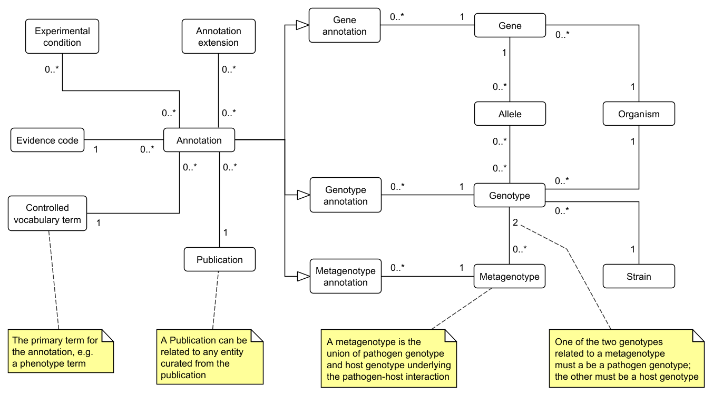

# PHI-base data model

This document describes the conceptual model and various schemas that are used by the PHI-base project.

## Definitions

- **PHI-base**: The Pathogen-Host Interaction Database. Two versions of PHI-base are currently being maintained in parallel:

	- **PHI-base version 5**: PHI-base 5 is the latest version of PHI-base. PHI-base 5 uses a MongoDB database to store its data. The website is: <https://phi5.phi-base.org>

	- **PHI-base version 4**: PHI-base 4 is a legacy version of PHI-base that uses a relational schema defined using MariaDB. This document will not describe the schema used for PHI-base 4. The website is: <http://www.phi-base.org>

- **Canto**: the Community Annotation Tool. Canto is a web application developed by PomBase, originally for curating knowledge from the literature about fission yeast (*Schizosaccharomyces pombe*).

- **PHI-Canto**: a reconfigured version of Canto that supports the annotation of pathogen-host interactions and individual pathogens and hosts. PHI-Canto was developed by the PHI-base team in collaboration with the PomBase team.

- **cv**: an abbreviation of 'controlled vocabulary' that is used in the Canto schema.

## Schemas

There are several schema files included with this document that are used across the various PHI-base applications.

- **PHI-Canto schema**: the PHI-Canto schema is identical to (and shared with) the schema used for the Canto curation application. It consists of two schemas:

	- **Curs schema**: 'Curs' is an abbreviation of 'curation session'. This schema is for individual curation sessions, each of which corresponds to a publication. See the file canto_curs.sql.

	- **Track schema**: the Track schema is for data shared across all curation sessions. See the file canto_track.sql.

- **PHI-Canto export schema**: this schema describes the JSON file format that is exported from PHI-Canto prior to loading into PHI-base 5. See the file [canto_json_export.schema.json](./canto_json_export.schema.json).

- **PHI-base 5 export schema**: this is the JSON export file that is provided as a full download of the PHI-base 5 database on Zenodo. This export file is augmented with data retrieved from UniProtKB and PubMed, plus PHIG identifiers and other information. See the file [phi-base_v5_import.schema.json](./phi-base_v5_export.schema.json).

- **PHI-base 5 schema**: this schema describes documents in the CantoStore collection of the PHI-base 5 MongoDB database. See  the file [CantoStore.schema.json](./CantoStore.schema.json). See also: [Appendix: Lack of schema alignment](#appendix-lack-of-schema-alignment) for an explanation of why this schema differs from the PHI-Canto export schema.

## Concepts

This section describes the high-level concepts that are common across all schemas used by PHI-base.

The concepts are shown as a diagram below:



### Gene

The PHI-base conceptual model does not make a clear distinction between genes and proteins.

**Relations**: Each gene references one organism, which is the organism of the gene.

**Identity**: In PHI-base 5, a gene is primarily identified by a PHIG identifier (e.g. PHIG:253) and also identified by an accession number from the UniProt knowledge base (e.g. UniProtKB:Q00909). See [Appendix: gene identifiers](#appendix-gene-identifiers) for an explanation.

### Allele

Alleles have the following properties that are not shown in the diagram of the conceptual model:

- A **name** provided by the curator.
- A **type**, which describes the mutation (or lack thereof) applied to the gene. For example: wild type, deletion, amino acid substitution, nonsense mutation, and so on.
- A **description**, which contains additional information about the mutation, such as the range of amino acids substituted.

**Relations**: Each allele is an allele of one gene, and each gene can have zero or more alleles.

**Identity**: Alleles are identified by an internal identifier scheme which we reused from Canto.

### Genotype

Each genotype has zero or more loci as a property. Each locus relates to one or more alleles. If a genotype has no loci, it is a wild-type genotype.

Each allele at a locus may have an expression level as a property. For example: 'Overexpression' or 'Knockdown'.

**Relations**: Each genotype relates to one organism and one strain, and can have zero or more alleles. Each allele can belong to zero or more genotypes.

**Identity**: Genotypes are identified by an internal identifier scheme which we reused from Canto.

### Strain

In PHI-Canto user interface, strains are first entered by the curator as a property of the organism, but in the data model they are a property of the genotype of an organism.

**Relations**: Each strain is related to zero or more genotypes. Each genotype is related to one strain.

**Identity**: Strains are identified by their name.

### Organism

Organisms have a scientific name that is loaded from UniProtKB, but that scientific name can be overridden by a name preferred by PHI-base (for example, renaming *Gibberella zeae* to *Fusarium graminearum*).

**Relations**: Each Organism is related to zero or more genes and zero or more genotypes. Each gene and each genotype is related to one organism.

**Identity**: Organisms are identified by an NCBI Taxonomy identifier.

### Metagenotype

A metagenotype is a concept originally developed for PHI-Canto. The metagenotype represents the underlying genotype of a pathogen-host interaction. The metagenotype is a union of a pathogen genotype and a host genotype: it is *meta* in the sense that it is a genotype of genotypes.

Each metagenotype has one pathogen genotype and one host genotype. Either of the pathogen genotype or the host genotype can be a mutant genotype or a wild-type genotype.

The metagenotype is conceptually similar to a metagenome, except restricted to only two species and without the focus on any particular environment.

The motivation for the metagenotype was partly pragmatic: it allowed PHI-base to extend the existing annotation workflow in Canto for single species genotypes to multi-species genotypes.

**Relations**: Each metagenotype is related to exactly two genotypes (a pathogen genotype and a host genotype). Each genotype can be related to zero or more metagenotypes.

**Identity**: Metagenotypes are identified by an internal identifier scheme which we reused from Canto.

### Annotation

An annotation can be thought of as a binary relation (named 'annotates') between a controlled vocabulary term and a biological entity. Each annotation instance associates exactly one controlled vocabulary term with exactly one biological entity.

- The source (domain) of an annotation is a controlled vocabulary term, including ontology terms. A controlled vocabulary term may be the source of zero or more annotations.

- The target (range) is a biological entity, such as a gene, genotype, or metagenotype. A biological entity may be the target of zero or more annotations.

Each annotation has an annotation type that constrains both the biological entities that may be used as annotation targets and the controlled vocabulary terms that may be used as annotation sources.

For example, an annotation of type molecular_function may only target a gene and may only use terms from the Molecular Function namespace of the Gene Ontology.

**Relations**: Each annotation relates to one of the following: a gene, genotype, or metagenotype. Each gene, genotype, or metagenotype may have zero or more annotations.

Several other concepts are related to annotations as properties of an annotation:

- one Evidence Code (a controlled vocabulary term),

- zero or more Experimental Condition instances (controlled vocabulary terms),

- zero or more Annotation Extension instances (described in the [Annotation extensions](#annotation-extensions) section below).

**Identity**: Annotations have no identity in PHI-base (or in Canto).

### Publication

Due to a restriction in PHI-Canto, it is only possible to curate publications from PubMed. This restriction also derives from a long-established rule that PHI-base only curates publications that have been peer-reviewed by select journals.

**Relations**: Any entity can relate to a publication, since all information in PHI-base is curated from publications. But in practice, each publication relates to zero or more annotations, and each annotation relates to one publication (because any other entity can also be related to an annotation in some way).

**Identity**: Each publication is identified by a PubMed identifier (PMID).

## Annotation types

As mentioned above, annotations in PHI-base are constrained by the biological entity that the annotation is applied to.

The sections below show the current list of annotation types.

### Gene annotation types

- GO molecular function
- GO biological process
- GO cellular component
- Physical interaction
- Protein modification
- Wild-type RNA level
- Wild-type protein level

### Genotype annotation types

- Host phenotype
- Pathogen phenotype

### Metagenotype annotation types

- Pathogen-host interaction phenotype
- Gene-for-gene phenotype
- Disease name

## Annotation extensions

Annotation extensions are annotations applied to other annotations.

PHI-base mainly uses annotation extensions to annotate a primary phenotype with additional information, such as:

- The host tissue that was infected during a pathogen-host interaction.

- The change in the infective ability of the pathogen, resulting from the primary phenotype. For example: a primary phenotype of 'absence of hyphae' leads to 'loss of pathogenicity'.

- The penetrance of a phenotype across a multicellular population, or the severity of a phenotype in a single organism.

Like annotations, each annotation extension is a relation with a domain and a range.

- The source (domain) of an annotation extension is a set of ontology terms.

- The target (range) is a value of various types, such as a set of ontology terms, a gene (protein) identifier, a metagenotype, or a text string.

Each annotation extension has a name (e.g. infects_tissue) and a cardinality that controls how many times the annotation extension can be applied to one annotation.

## Appendix: Implicit references in PHI-Canto

One limitation of the PHI-Canto JSON export schema is that objects in one collection may reference the identifiers of objects in another collection, but the semantics of these references are not explicit, because we use plain JSON instead of a linked data format like JSON-LD.

The following sections show the implicit references between objects. 

### Genes

Each gene object in the `genes` object contains a reference to an organism in the `organisms` object, but this reference uses the scientific name of the organism (the `full_name` property of the organism) instead of the NCBI Taxonomy ID.

The `uniquename` field of the gene object is a reference to a UniProtKB accession, using a UniProtKB accession number, but this is also stored as a text string. 

```json
{
	"genes": {
		"Colletotrichum gloeosporioides L2FLE8": {
			"organism": "Colletotrichum gloeosporioides",
			"uniquename": "L2FLE8"
		}
	}
}
```

### Alleles

Each allele object in the `alleles` object contains a plain text reference to the identifier of a gene object from the `genes` object.

The gene identifier is stored in the `gene` property of the allele object.

(The identifier of the gene object is the scientific name of the species followed by the UniProtKB accession number of the gene.)

```json
{
	"alleles": {
		"L2FLE8:009d988d74fce8f4-2": {
			"allele_type": "wild_type",
			"gene": "Colletotrichum gloeosporioides L2FLE8",
			"name": "Ste12+",
			"primary_identifier": "L2FLE8:009d988d74fce8f4-2",
			"synonyms": []
		},
	}
}
```

### Genotypes

Each genotype object in the `genotypes` object has zero or more `id` properties that reference an allele identifier, which are nested within the `loci` array.

(The identifier of each allele object is the UniProtKB accession number of the gene, followed by the curation session identifier, followed by a number that increments for each allele object.)

In the genotype object below, `L2FLE8:009d988d74fce8f4-2` is an allele identifier that references the allele shown in the section above.

Each genotype object also references an organism from the `organisms` object, using a NCBI Taxonomy identifier as an integer (in the `organism_taxonid` property of the genotype object).

```json
{
	"genotypes": {
		"009d988d74fce8f4-genotype-2": {
			"loci": [
				[
					{
						"expression": "Wild type product level",
						"id": "L2FLE8:009d988d74fce8f4-2"
					}
				]
			],
			"organism_strain": "CFCC80308",
			"organism_taxonid": 474922
		}
	}
}
```

### Metagenotypes

Each metagenotype object in the `metagenotypes` object has

- a `host_genotype` property that references the identifier of a host genotype, and 
- a `pathogen_genotype` property that references the identifier of a pathogen genotype.

In the example below:

- `Populus-x-beijingensis-wild-type-genotype-Unknown-strain` is the host genotype identifier. This genotype is wild-type. The identifier references the wild-type host genotype shown in the section above.

- `009d988d74fce8f4-genotype-2` is the pathogen genotype identifier. This genotype is a mutant. The identifier references the mutant pathogen genotype shown in the section above.

```json
{
	"metagenotypes": {
		"009d988d74fce8f4-metagenotype-2": {
			"host_genotype": "Populus-x-beijingensis-wild-type-genotype-Unknown-strain",
			"pathogen_genotype": "009d988d74fce8f4-genotype-2",
			"type": "pathogen-host"
		}
	}
}
```

### Annotations

Each annotation object in the `annotations` array contains a reference to an identifier of a  biological feature: either a gene, genotype, or metagenotype.

In the example below, the `metagenotype` property of the annotation object references the identifier of the metagenotype object shown in the section above.

Additional plain text references include:

- The `publication` property references a PubMed identifier as a plain text string.

- The following properties refer to ontology terms using the OBO ID of an the term, rather than the IRI of the term:

	- The `term` property.

	- The `rangeValue` property of the annotation extensions in the `extension` array.

	- The values of the `conditions` array (which represent experimental conditions like high pH or low temperature).

(Note that our experimental conditions do *not* refer to terms from the Plant Experimental Conditions Ontology. See the section [Appendix: PECO prefix conflict](#appendix-peco-prefix-conflict) for an explanation.)

```json
{
	"annotations": [
		{
			"conditions": [
				"PECO:0005227"
			],
			"creation_date": "2025-11-27",
			"curator": {
				"community_curated": true
			},
			"evidence_code": "Macroscopic observation (qualitative observation)",
			"extension": [
				{
					"rangeDisplayName": "leaf",
					"rangeType": "Ontology",
					"rangeValue": "BTO:0000713",
					"relation": "infects_tissue"
				}
			],
			"figure": "Figure 5",
			"metagenotype": "009d988d74fce8f4-metagenotype-2",
			"publication": "PMID:38748933",
			"status": "new",
			"term": "PHIPO:0000954",
			"type": "pathogen_host_interaction_phenotype"
		}
	]
}
```

### Publications

The `publications` object contains the PubMed identifier for the publication as a plain text string.

```json
{
	"publications": {
		"PMID:38748933": {}
	}
}
```

### Metadata

The `metadata` object also contains the PubMed identifier for the publication as a plain text string, in the `curation_pub_id` property.

```json
{
	"metadata" : {
		"accepted_timestamp" : "2025-11-27 07:20:39",
		"annotation_mode" : "advanced",
		"annotation_status" : "APPROVED",
		"annotation_status_datestamp" : "2026-02-03 12:00:55",
		"approval_in_progress_timestamp" : "2026-02-03 11:52:26",
		"approved_timestamp" : "2026-02-03 12:00:55",
		"canto_session" : "009d988d74fce8f4",
		"curation_accepted_date" : "2025-11-27 07:20:39",
		"curation_in_progress_timestamp" : "2025-11-27 07:21:39",
		"curation_pub_id" : "PMID:38748933",
		"curator_role" : "community",
		"first_approved_timestamp" : "2026-02-03 12:00:55",
		"has_community_curation" : true,
		"needs_approval_timestamp" : "2026-01-06 11:44:37",
		"session_created_timestamp" : "2025-11-27 07:20:30",
		"session_first_submitted_timestamp" : "2026-01-06 11:44:37",
		"session_genes_count" : "1",
		"session_term_suggestions_count" : "0",
		"session_unknown_conditions_count" : "0",
		"term_suggestion_count" : "0",
		"unknown_conditions_count" : "0"
	},
}
```

## Appendix: gene identifiers

### UniProtKB accession numbers

PHI-Canto uses protein identifiers from UniProtKB due to a limitation imposed by Canto.

PHI-base chose UniProtKB because Canto already had the capability to pre-populate details about the gene from UniProtKB (such as gene names and species name). UniProtKB was also faster at adding information about proteins of novel pathogens or novel pathogen strains.

PomBase use their own systematic gene identifiers in Canto, so they do not need to use UniProtKB accession numbers. Using systematic gene identifiers was not a solution for PHI-base because we are a multi-species database, and many of the species we curate do not have systematic gene names.

### PHI-base gene identifiers

PHI-base 5 introduced new gene identifiers, called PHIG (PHI-base Gene) identifiers.

For example: PHIG:253 is the PHIG identifier for the TRI5 gene of *Fusarium graminearum*.

The motivation for these PHIG identifiers was to have an identifier scheme that was isolated from UniProtKB. This was motivated by the repeated problems we faced due to UniProt's efforts to [reduce proteome redundancy](https://www.uniprot.org/help/proteome_redundancy) by removing accessions from UniProtKB.

Ideally, these PHIG identifiers would allow the gene to be remapped to a new UniProtKB accession number in the event that the current accession number is made obsolete.

Meaning, some aspect of the gene's identity could be preserved, regardless of UniProt's actions (though this does not intend to solve any underlying ontological issues regarding gene identity).

In practice, the PHIG identifiers are currently a one-to-one mapping to UniProtKB accession numbers. There have been no cases yet where the remapping has been performed.

The PHIG identifiers are meant to be kept stable across data releases of PHI-base 5, but in practice this has not always happened, due to errors in implementation from our subcontractor and lack of effective oversight from the PHI-base team.

This lack of identifier persistence is a significant barrier to a semantic representation of PHI-base.

## Appendix: Lack of schema alignment

The subcontractor who developed the PHI-base 5 database chose to reuse the schema from the PHI-Canto JSON export file when designing the PHI-base 5 schema.

Unfortunately, due to failure in communication, lack of oversight, and lack of time for corrections, the PHI-base 5 schema differs in several ways to the PHI-Canto JSON export file schema.

The intention is to align the PHI-base 5 schema to the PHI-Canto JSON export file schema (especially the naming conventions), but there has been no progress with this task yet due to having to resolve other more critical maintenance issues.

## Appendix: PECO prefix conflict

In the context of PHI-base, PECO refers to a bespoke, domain-specific controlled vocabulary created by PHI-base, called the [PHI-base Experimental Conditions Ontology](https://github.com/PHI-base/phi-eco) (PHI-ECO).

This name conflict was inherited from the Pombe Experimental Conditions Ontology that PHI-ECO was derived from.

The Pombe Experimental Conditions Ontology has since been renamed to the Fission Yeast Experimental Conditions Ontology (FYECO), but we haven't changed the prefixes in PHI-ECO to something that doesn't clash with PECO.

For example, we should be using a prefix like 'PHIECO'. This *must* be fixed before we seriously attempt any semantic integration with other sources.
