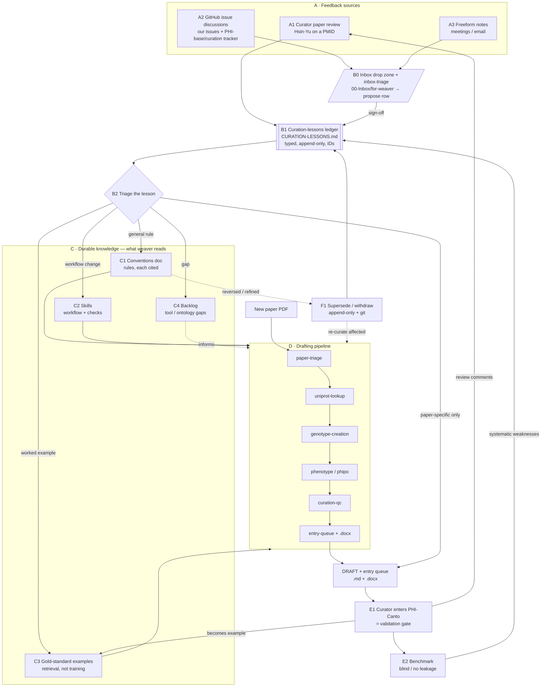

```table-of-contents
title: 
style: nestedList # TOC style (nestedList|nestedOrderedList|inlineFirstLevel)
minLevel: 0 # Include headings from the specified level
maxLevel: 0 # Include headings up to the specified level
include: 
exclude: 
includeLinks: true # Make headings clickable
hideWhenEmpty: false # Hide TOC if no headings are found
debugInConsole: false # Print debug info in Obsidian console
```
# PHI-Weaver Learning System — dynamic learning & relearning

**Canonical for:** how PHI-Weaver improves over time — the mechanism. The running log of
individual lessons is [`CURATION-LESSONS.md`](CURATION-LESSONS.md); the rules a lesson
eventually becomes live in `07-Standards/` and `skills/`. See [`README.md`](README.md).

**Purpose of this doc:** an explicit, diagram-ready description of how PHI-Weaver improves over
time — the components (nodes), the flows between them (edges), and the two feedback loops
(*dynamic learning* and *relearning / reversal*). It is written so it can be handed to a diagramming
AI (e.g. Hermes) or turned into the Mermaid source at the bottom. Every node names the real file
that implements it, so the diagram reflects the system as built, not an aspiration.

## Core principle (state this on the diagram)
Weaver **learns declaratively**: it improves by editing the *rules and examples it reads at drafting
time*, **not** by fine-tuning a model. Consequences that shape the whole design:
- A lesson only changes behaviour once it is folded into a rule (conventions/skills) or an example
  (gold-standard library) — a log entry alone changes nothing.
- Because there is no trained weight to unlearn, a decision can be **withdrawn or reversed** with a
  simple edit that the next draft follows immediately — fully auditable via git.
- Every rule must cite its source (issue #, lesson id, curator sign-off), so provenance is
  verifiable and reversals are traceable.

## Layers & nodes

**A. Feedback sources** (where lessons originate)
- `A1` **Curator paper review** — Hsin-Yu Chang reviews a specific draft (e.g. PMID:42089373).
- `A2` **GitHub issue discussions** — our own issues to the curator + the `PHI-base/curation`
  tracker mined for team decisions (see DESIGN-DECISIONS D17).
- `A3` **Freeform notes** — meetings / email; weakest provenance (paraphrase, no permalink).

**B. Intake & triage**
- `B0` **Inbox drop zone + triage skill** — `00-Inbox/for-weaver/` (raw, non-authoritative drop
  zone, outside the drafting/benchmark read path) processed by the `inbox-triage` skill. The
  concrete front door for `A2`/`A3` (and dropped `A1` reviews): identify source + provenance, check
  whether the point is already covered, and **propose** a `B1` row + the durable edit for human
  sign-off. Processed items move to `done/` with their `L`-id. Never auto-applies.
- `B1` **Curation-lessons ledger** — `docs/CURATION-LESSONS.md`: typed (`issue` / `paper-review` /
  `meeting` / `email` / `note`), **append-only**, stable IDs (`L1`, `L2`, …).
- `B2` **Triage** — classify each lesson: general rule vs. tool/ontology gap vs. worked example vs.
  paper-specific-only.

**C. Durable knowledge — what weaver reads at drafting** (the "learned" state)
- `C1` **Conventions doc** — `07-Standards/PHI-Canto-Curation-Conventions.md` (rules, each cited).
- `C2` **Skills** — `skills/*` (workflow steps, incl. embedded convention checks).
- `C3` **Gold-standard examples** — `07-Standards/curation-examples/` (retrieval, *not* training).
- `C4` **Backlog** — `docs/BACKLOG.md` (tool + ontology gaps to fix).

**D. Drafting pipeline** (reads C, curates a paper)
- `D1` paper-triage → `D2` uniprot-lookup → `D3` genotype-creation →
  `D4` phenotype-annotation (via phipo-mapping) [+ gene-for-gene when applicable] →
  `D5` curation-qc → `D6` entry-queue + `.docx` export.
- Input `D0` **new paper PDF**; output `D7` **DRAFT + entry queue** (`.md` + `.docx`).

**E. Validation & measurement**
- `E1` **PHI-Canto entry = validation gate** — a curator entering the draft into
  canto.phi-base.org *is* the validation step (DESIGN-DECISIONS D13). This produces ground truth.
- `E2` **Benchmark** — scorecards → `batch_summary` → `benchmark_report`, run **blind / no
  leakage** (GitHub and PHI-base excluded); records model + tokens (D7 provenance, D12 independent
  scorer).

**F. Relearning / reversal**
- `F1` **Supersede / withdraw** — append-only status change in the ledger + in-place "superseded"
  marking in the conventions doc; git holds the exact history.
- `F2` **Re-curation of affected papers** — when a reversed convention materially changes past
  drafts (recuration-comparison workflow, `docs/BACKLOG.md`).

## Flows (edges — use these directly for the diagram)
- `A2, A3 → B0` — dropped feedback lands raw in the inbox; `inbox-triage` processes it. (A dropped
  `A1` review can enter the same way.)
- `B0 → B1` — the skill proposes a typed ledger row (after the already-covered check), on human
  sign-off. `A1 → B1` a curator review can also be logged directly.
- `B1 → B2` — each logged lesson is triaged.
- `B2 → C1` general rule · `B2 → C2` workflow change · `B2 → C3` worked example · `B2 → C4` gap ·
  `B2 → D7` "paper-specific only → fix this draft, not the pipeline".
- `C1, C2, C3 → D*` — the pipeline **reads** conventions, skills and examples while drafting;
  `C4 ⇢ D*` informs (gaps flagged, not silently forced).
- `D0 → D1 → … → D6 → D7` — the drafting sequence.
- `D7 → E1` — curator enters the draft into PHI-Canto (validation).
- `E1 → E2` — validated curations feed the benchmark; `E1 → C3` a fully-correct curation becomes a
  gold-standard example; `E1 → A1` the review itself is a feedback source (**loop closes**).
- `E2 → B1` — benchmark findings (systematic weaknesses) log new lessons.
- **Dynamic-learning loop:** `A → B → C → D → E → A`.
- **Relearning loop:** `C1 → F1 → B1` (reverse/refine a rule) and `F1 → F2 → D*` (re-curate
  affected papers); git underlies both.

## Constraints to show as guardrails
- **Human validation gate (D13):** nothing is "truth" until a curator validates it in PHI-Canto.
- **Benchmark integrity:** measurement runs blind and leakage-free; GitHub/PHI-base kept out of
  scored runs (raw issues are mined into conventions, never ingested).
- **Provenance (D7 / D17):** every rule cites its source; freeform (`meeting`/`email`/`note`)
  lessons need a citable basis (sign-off or a resolved issue) before becoming a stated convention.
- **Append-only ledger:** lessons are superseded, never overwritten.

## Mermaid source (paste into a renderer or hand to Hermes as a starting point)



## Node → file index
| Node | Implemented by |
| --- | --- |
| B0 inbox + triage | `00-Inbox/for-weaver/` (+ `README.md`) + `skills/inbox-triage/SKILL.md` |
| B1 ledger | `docs/CURATION-LESSONS.md` |
| C1 conventions | `07-Standards/PHI-Canto-Curation-Conventions.md` |
| C2 skills | `skills/` (paper-triage, uniprot-lookup, genotype-creation, phenotype-annotation, phipo-mapping, gene-for-gene, curation-qc, canto-entry-queue, benchmark, gold-standard-import) |
| C3 examples | `07-Standards/curation-examples/` |
| C4 backlog | `docs/BACKLOG.md` |
| D6 output | `phiweaver/canto/entry_queue.py` + `phiweaver/export/docx.py` |
| E2 benchmark | `07-Standards/curation-benchmarking/` + `phiweaver/batch_summary.py` |
| design rationale | `docs/DESIGN-DECISIONS.md` (D7, D12, D13, D16, D17) |
